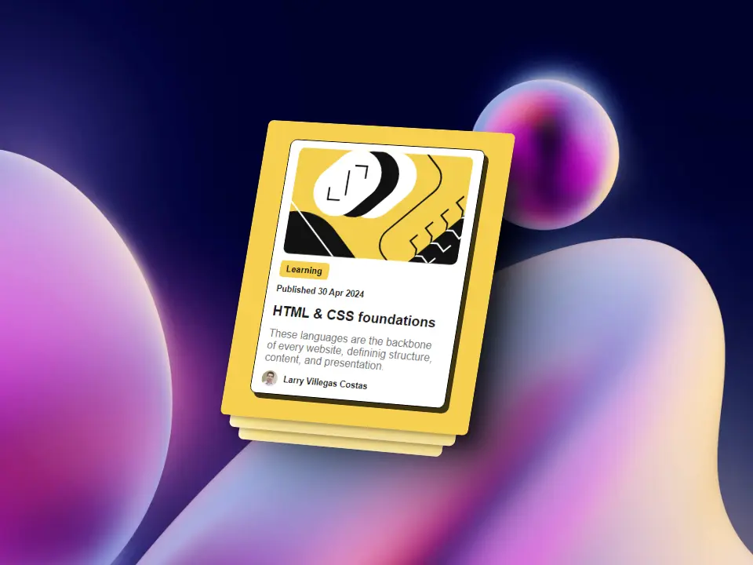
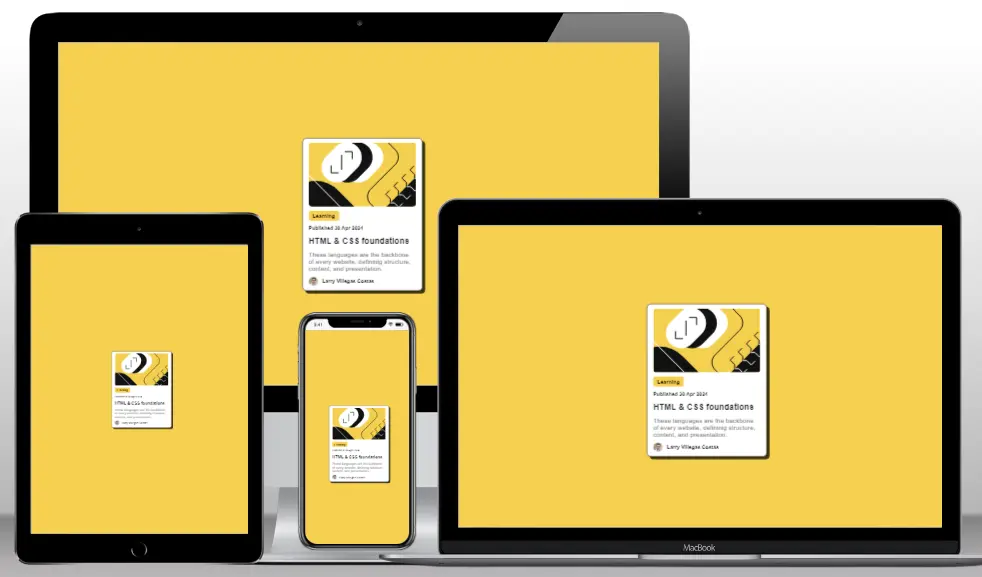

<div align="center" style="text-align: center">

  <h1><b>PROY02: Blog Preview Card - 100daysofprojects<b></h1>
</div>

[Blog Preview Card] construido con `HTML` y `CSS`, para mejorar nuestras habilidades de codificación. Este proyecto es el primero de los desafios #100daysofprojects promovido por [Frontend Club](https://www.facebook.com/frontendclubfb).



### Tabla de contenidos

- [Descripcion](#descripcion)
  - [El desafio](#el-desafio)
  - [Capturas](#capturas)
  - [Enlaces](#enlaces)
- [Flujo de trabajo](#flujo-de-trabajo)
  - [Desarrollo](#desarrollo)
  - [Recursos](#recursos)
- [Agradecimientos](#agradecimientos)
- [Contacto](#contacto)
- [Licencia](#licencia)

## Descripcion

### El desafio

Crear una tarjeta vista previa para un blog, usando `HTML` y `CSS`, y lograr que se parezca lo más posible al diseño.

### Los usuarios deberían poder:

1. Ver el diseño óptimo en pantallas grandes(1200px) y pequeñas(375px).
2. Ver un color amarillo(hover) al pasar el mouse sobre el título de la tarjeta.
3. Ver una sombra de fondo(hover) aumentada al pasar el mouse sobre la tarjeta.

### Importante:

1. Agrega icono favicon al proyecto.
2. Agrega una URL fácil de recordar (ej. `02-blog-preview-card`).
3. Agrega un título al proyecto (ej. `Blog Preview Card - Frontend Club`).
4. **Bonus**: Agrega un archivo README.md al proyecto.


### Capturas

Agrega capturas de pantalla en móvil, tabletas y escritorio.



### Enlaces

- [Proyecto](https://02-blog-preview-card-larry.netlify.app/)
- [Repositorio](https://github.com/LarryIVC/100_days_of_projects_day2)

## Flujo de trabajo

### Desarrollo

**Estructura del proyecto**

```txt
/
📂
├── 📂css/│ 
│ └── style.css
├── 📂images/
│ └── day02.webp
│ └── favicon.png
│ └── illustration-article.svg
│ └── larry.webp
│ └── logo.webp
│ └── mockup.webp
└── index.html
└── LICENSE
└── README.md
```

**Tecnologías**

1. `HTML` Semántico
2. Estilos `CSS`
3. Animaciones `CSS`
4. `Git` y `GitHub`
5. `Netlify`

**Flujo de desarrollo**

1. Análisis del diseño
2. Configuración inicial
   - Vincular archivos y librerías
   - Iniciar proyecto con Git
3. Marcado HTML
   - Estructura semántica
   - Atributos accesibles
   - Enlaces y rutas
4. Estilos CSS
   - De arriba hacia abajo
   - Estilos reutilizables
   - Estilos personalizados
5. Flujo de trabajo `mobile-first`

**Fragmentos de codigo**

Etiquetas `meta` para el SEO.

```html
<meta name="author" content="Larry Villegas Costas" />
<meta
  name="title"
  content="Blog Preview Card - Larry Villegas Costas - Frontend Club"
/>
<meta
  name="description"
  content="Blog Preview Card - Larry Villegas Costas - Frontend Club"
/>
<title>
      Blog Preview Card - Larry Villegas Costas - Frontend Club - day2
</title>
```

Animaciones CSS.

```css
article:hover {
  -webkit-box-shadow: 15px 15px 0px 0px rgba(0, 0, 0, 0.75);
  -moz-box-shadow: 15px 15px 0px 0px rgba(0, 0, 0, 0.75);
  box-shadow: 15px 15px 0px 0px rgba(0, 0, 0, 0.75);
}

footer h2 {
  font-size: 0.8rem;
  color: #1b1b1b;
  font-weight: 700;
  transition: all 0.3s ease-in-out;
}

footer a:hover > h2 {
  color: #f6d050;
}
```

### Recursos

Comparte los recursos que hayas utilizado para completar este proyecto.

1. [Frontend Club](https://www.facebook.com/frontendclubfb) - Comunidad de desarrollo web
2. [Netlify](https://www.netlify.com/) - Plataforma de alojamiento web
3. [Multi Device Website Mockup Generator](https://techsini.com/multi-mockup/index.php) - Generador de maquetas
4. [SVGOMG](https://jakearchibald.github.io/svgomg/) - Optimizador de SVG
5. [Squoosh](https://squoosh.app/) - Optimizador de imágenes
6. [Shots](https://shots.so/) - Capturas de pantalla

## Agradecimientos

- Mi familia que siempre me apoya en mis proyectos
- Mi streeamer favorito que me inspira a seguir adelante [@midudev](https://www.twitch.tv/midudev)

## Contacto

Agrega los medios de contacto para que cualquiera pueda encontrarte y hablar sobre tus siguientes grandes proyectos.

- [LinkedIn](https://www.linkedin.com/in/larryvillegascostas/)
- [Facebook](https://www.facebook.com/profile.php?id=1201373751)
- [GitHub](https://github.com/LarryIVC)
- [Correo](mailto:larry_villegas@hotmail.com)
- [Twitter](https://twitter.com/LarryVillegas)
- [Portfolio](https://portfolio-larry.netlify.app/)

## Licencia

Este proyecto está bajo la Licencia (MIT) - mira el archivo [LICENSE](LICENSE) para detalles

*No dudes en contactarme si crees que te puedo ayudar en algún proyecto o tienes un trabajo para mi.*
